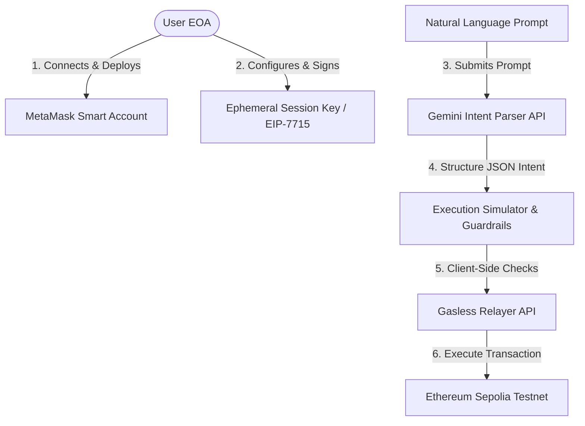

# DelegAI Guardian: Project Overview

DelegAI Guardian is a security orchestration dashboard that acts as a secure, intelligent intermediary between human intent (expressed in natural language) and on-chain blockchain execution. By combining AI-driven intent parsing, Smart Accounts, and granular EIP-7715 session keys, it allows users to safely delegate transaction authority to autonomous agents under strict, cryptographically enforced guardrails.

---

## 🚀 How It Works (Core Architecture)

1. **Smart Account Initialization**: A hybrid Smart Account (ERC-4337 / EIP-7702 / EIP-7710 compatible) is deterministically generated for the user using their connected MetaMask Externally Owned Account (EOA) via the MetaMask Smart Accounts Kit (SAK).
2. **Delegation Config (EIP-7715)**: The user defines specific permissions for an agent—such as a daily spend limit, duration, and whitelisted destination addresses. This delegation is signed cryptographically by the user's MetaMask wallet.
3. **Natural Language Intent Parsing**: The user provides instructions in natural language (e.g., *"pay 100 USDC for rent"*). The system uses the Google GenAI SDK (running Gemini `gemini-2.5-flash` in an API route) to translate this prompt into a structured JSON execution payload.
4. **Safety Verification & Execution**: Before execution, the system simulates the transaction and verifies it against the delegation's caveat rules (on-chain guardrails). If verified, the transaction is executed gaslessly on Sepolia through a sponsored paymaster API route.

---

## 🛠️ What Has Been Done (Live Features)

The following components are fully operational and run live on-chain or use real APIs:

*   **MetaMask EOA Connection**: Connects to the user's wallet via Wagmi/Viem, retrieving live EOA addresses and network state.
*   **Deterministic Smart Account Creation**: Deploys/derives a deterministic smart account using `@metamask/smart-accounts-kit`.
*   **Ephemeral Session Key Generation**: Generates a real ephemeral private key inside the browser via Viem (`generatePrivateKey()`) to act as the agent's delegation key.
*   **Gemini-Powered Intent Parsing**: Resolves user prompts to structured transactions via the `/api/agent` backend route using the Google GenAI SDK.
*   **EIP-7715 Delegation Signing**: Prompts the user's MetaMask to sign an EIP-7715 delegation schema using `smartAccountInstance.signDelegation`.
*   **Live Balance Syncing**: Queries Sepolia testnet live for both the Smart Account's ETH and mock USDC balances, and the agent session key's ETH balance.
*   **Gasless Sponsor Relayer**: A Next.js API route (`/api/relay`) submits transaction payloads to Sepolia using a live sponsor account funded with Sepolia ETH.

---

## 🧪 Simulated & Mocked Components (For Presentation / Demo)

To ensure a smooth presentation flow and bypass current smart contract limitations, certain components use simulated or mock fallbacks:

*   **Override Presentation State**: If a newly generated smart account reads `0` USDC or has `0` allowance, the simulator force-overrides these values to `1000` USDC to allow the user to demonstrate a successful "green path" execution.
*   **Stubbed Caveat Enforcers**: No custom enforcer contracts are deployed on Sepolia yet. The application stubs the enforcer addresses to `0x0000...0001` and `0x0000...0002`.
*   **Calldata Builder Template**: The transaction calldata compiler is hardcoded to parse ERC-20 `transfer(address,uint256)` transactions with a fixed 6-decimal representation, rather than compiling arbitrary smart contract calls.
*   **Static Spend Ceiling**: The verification step checks user transactions against a hardcoded limit of `500` USDC, rather than pulling the exact limit defined in the delegation rules.
*   **Relayer Fallback**: If the sponsor API route fails (e.g. running out of Sepolia gas), a client-side fallback triggers a simulated mining state and produces a mock transaction hash to prevent the UI from freezing.

---

## 🗺️ Roadmap & Current Gaps

To move from a hackathon prototype to a production-grade system, the following areas require development:

1.  **State Synchronization & Session Tracking**: Fix the `activeContextId` state issue so that the session status badge dynamically updates to show active EIP-7715 sessions after signing, rather than showing "No Active Session".
2.  **Persistent Settings**: Implement `localStorage` or context-level persistence for Developer Settings (e.g., Sandbox Mode, Local Simulator Fallback) so that settings are not reset upon tab navigation.
3.  **Dynamic Caveat & Rule Checking**: Replace the hardcoded `500` limit check with dynamic checks that match the exact parameters of the signed EIP-7715 delegation.
4.  **Arbitrary Contract Interactions & Multi-calls**: Expand the intent parser and calldata builder to support swapping, staking, or executing complex multi-step DeFi transactions.
5.  **On-Chain EIP-7715 Caveat Enforcers**: Deploy real caveat validation contracts on-chain to cryptographically reject unauthorized transactions at the Smart Account level.
